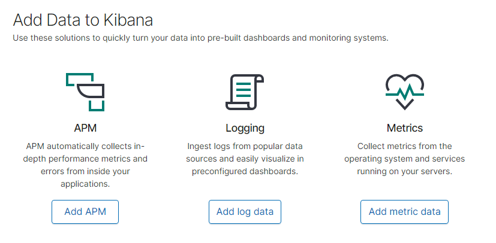
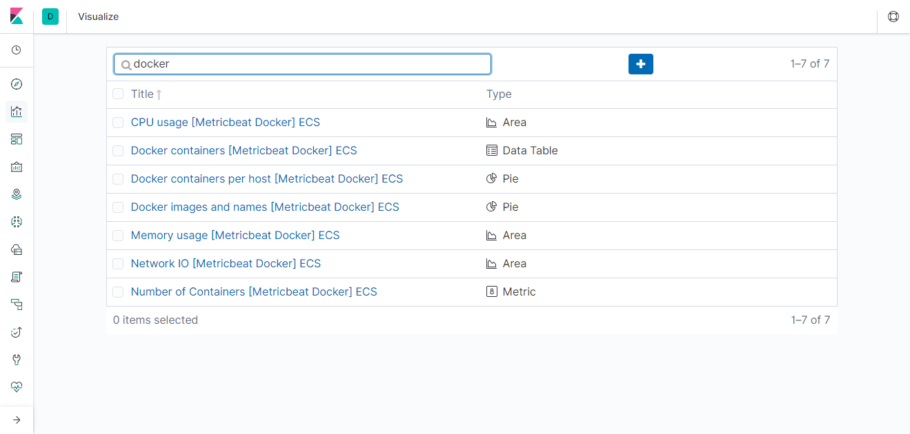
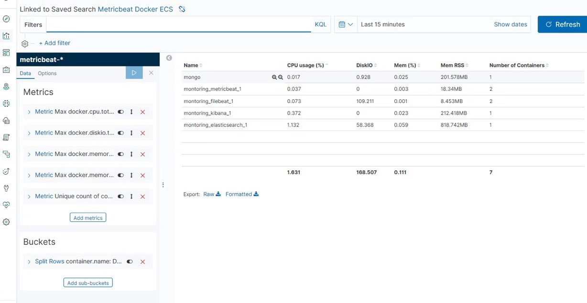
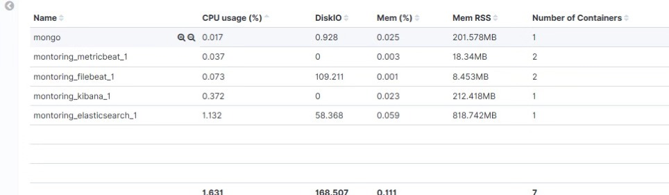
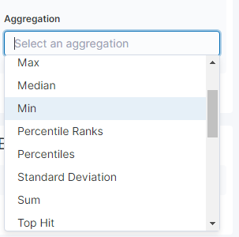
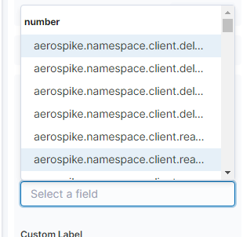
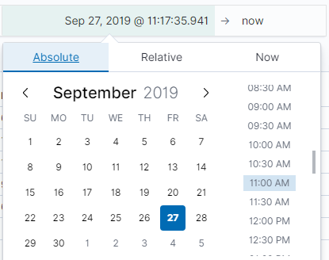
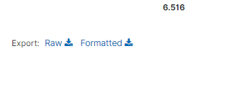
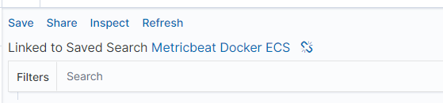
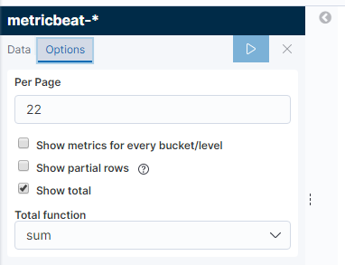

For the monitoring part of the container data, we use two open source tools: Kibana and Elasticsearch. Kibana is an open source analysis and visualization platform designed to work with Elasticsearch.You can use Kibana to search, view, and interact with data stored in the Elasticsearch index.You can easily perform advanced data analysis and visualize data in the form of various ICONS, tables, and maps.
Kibana makes it easy to understand large amounts of data.Its simple, browser-based interface allows you to quickly create and share dynamic dashboards that show changes in Elasticsearch queries in real time.
1. Among all the devices, find one device as the master node and the others as the slave node.
2. Configure the information of all devices in the SSH file on the master node.Then execute ssh-copy-id +hostname to set the no-secret login.
3. After configuration, make beat is executed in the directory where the makefile file of the primary node is located.Start the program.
4. When the program is finished, open the url output at the end of the program to view and modify relevant information.

**(1)** enter the page

**(2)** click the second navigation bar and enter docker as shown in the figure below. Click the second button

**(3)** add the required content on the left side, and the right side will display

**(4)** The Metrics section on the left can add what we need, as shown in the figure below. After clicking it, a drop-down box will appear and we can select what we want.

**(5)** In the time section on the upper right, we can set the time, which is divided into absolute time and relative time, that is, we can choose what time to what time, or the current time, hours, minutes, seconds, days ago.

**(6)** As shown in the figure below, you can download the data

**(7)** As shown in the figure below，you can save settings

**(8)** Click options, and then you can set how many items are displayed on each page.

5. If some device monitoring container is not started, you can copy the monitoring code to the device, then go to the directory where the makefile file is, and execute the make beat command,

6. Makerun runs on the primary node and make beat runs on the slave node